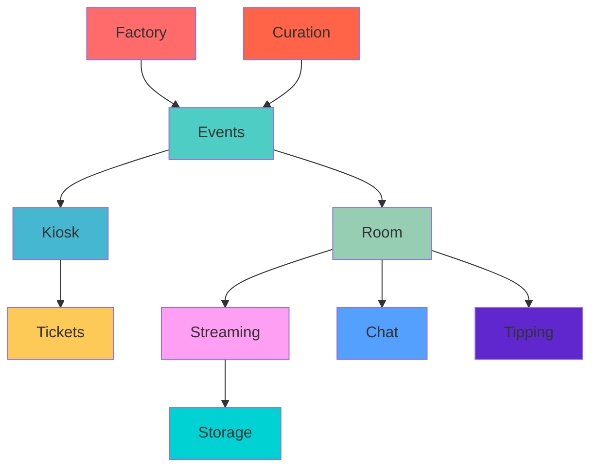

haus²⁵ is a decentralized livestreaming platform for performance artists to create, curate & monetize events that acquire value in real-time.

Built on Sei blockchain, haus²⁵ introduces a new paradigm for digital content ownership through Real-Time Assets (RTAs) — video NFTs that acquire value dynamically during live performances through community participation and real-time tipping.

## Platform Overview

haus²⁵ combines several technologies to create a seamless experience:

- **Smart contracts** for event creation, ticketing, revenue distribution and autonomous (AI-based) performer representation services.
- **WebRTC streaming** infrastructure for low-latency live video
- **Filecoin storage** for permanent, decentralized content preservation
- **XMTP chat** for real-time community interaction
- **Autonomous curation** agents for event optimization

## Key Features

### For Creators
- Create scheduled live events with customizable pricing
- Receive **70-80%** of revenue (vs 20-30% on traditional platforms)
- Real-time monetization through live tipping
- Autonomous curation services for event planning, content creation & promotion, streaming optimization, and post-production highlights

### For Audiences  
- Purchase tickets to access exclusive live events
- Participate in price discovery through live tipping
- Own the video and the rights of reproduction of the performance as video NFTs if you're the highest tipper
- Join community conversations during events

### Art Categories

haus²⁵ is specifically designed for performance art categories:

- **Standup comedy** - Live comedy performances and sets
- **Poetry slam** - Spoken word and poetry performances  
- **Performance art** - Contemporary dance and experimental art
- **Improv** - Improvisational comedy and theater
- **Live streaming** - From gaming to artwork creation and workshops
- **Podcasting** - Live podcast recordings and conversations

## Platform Architecture

